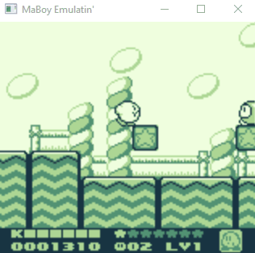
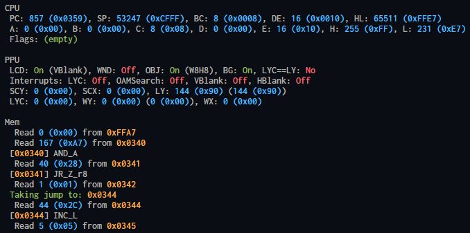

# MaBoy Game Boy Emulator

MaBoy is a fast and (mostly) accurate emulator for the original Game Boy (and Game Boy Pocket). Currently, it works only on Windows.

<p align="center">
  
</p>

*CAUTION: This project is a work in progress. Some games (like Pokemon Yellow) will not run yet. If there is demand, please let me know. For a more complete emulator, look at [Mooneye GB](https://github.com/Gekkio/mooneye-gb).*

## Running the Emulator

If you only care about using the emulator (and don't need access to the source code), go to the [releases page](https://github.com/1HPorange/maboy/releases) and download the newest one.

Otherwise, clone it and run it like any other Rust project. The project was written using *Rust 1.43*, so older versions might not work.

## Features

- Resizable window
- Fast / Low power usage
- Keyboard and Xbox gamepad input
- MBC1/MBC2/MBC3 cartridges
- Basic Debugger (debug builds only)

## Missing Features

- Audio
- B/W color scheme (without the green tint)
- Input settings / Key remapping
- UI (except for the output window, of course ;)
- Support for more cartridges (more MBCs)

## Input

The emulator supports Xbox Gamepads; Just make sure to plug them in *before* starting the emulator.

Otherwise the keyboard mapping is as follows:

| Game Boy  | Keyboard |
| ------------- | ------------- |
| A | K |
| B | J |
| START | N |
| SELECT | B |
| D-Pad | W,A,S,D |
| Debug Mode | G  |

## Debug Mode

<p align="center">
  
</p>

Debug mode pauses the emulator and displays a very basic debug CLI. It is **only available in debug builds** and supports stepping through instructions and setting breakpoints. Here are the commands that you can use:

```
// Resume emulation
run

// Step a single instruction
step

// Step multiple instructions
step [n/line/frame]

// Set a normal breakpoint
bp set [addr]

// Set a memory breakpoint (read/write)
bp mem [r/w/rw] [addr]

// List all breakpoints
bp list

// Remove a breakpoint
bp rm [index in list]

// Remove all breakpoints
bp clear
```

## Savegames

Savegames are automatically detected if they sit in the same folder as the game. If no savegame is present, it is automatically created (if the cartridge supports it).